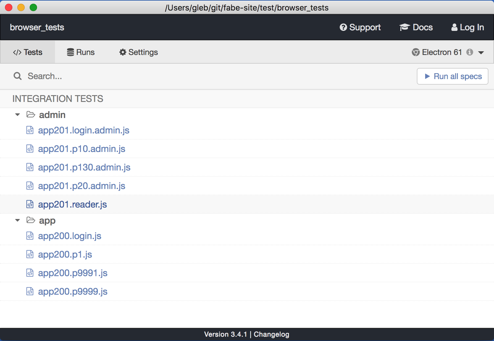

# Fabe browser tests [](https://circleci.com/gh/forallabeautifulearth/fabe-browser-tests/tree/master)

> End-to-end browser tests for [fab.earth](https://fab.earth) using [Cypress.io](https://www.cypress.io) test runner.

All tests are in folder [cypress/integration](cypress/integration) with the most important settings in [cypress.json](cypress.json) file. Each time the tests run on CI the screenshots and videos are stored as test artifacts.

## Install and use

To run Cypress you need [Node and NPM](https://nodejs.org/en/) installed and available from your terminal.

Cypress test runner is installed when you run `npm install` or `npm ci`.

```shell
npm install
```

To open Cypress in the interactive mode, from the root of the repository run command

```shell
npm run e2e
```

This should open Cypress GUI where you can pick and run a spec (test) file.



The tests run against `baseUrl` defined in [cypress.json](cypress.json) file. Typically this will be the dev deploy of the site and you would need `userPassword`, `adminPassword`, and maybe other passwords to be able to log in from tests. The simplest way is to pass these values via environment variables starting with `CYPRESS_` prefix by using [as-a](https://github.com/bahmutov/as-a) utility. Just create `~/.as-a/.as-a.ini` text file and put the environment variables there under a section, like `fabe`

```ini
[fabe]
CYPRESS_userPassword=<password string>
CYPRESS_adminPassword=<admin password string>
```

(Ask Hayden Hudson or Vincent Morneau if you want the relevant variables for a given environment)

Then, from the terminal run the command

```shell
as-a fabe npm run e2e
```

This will inject environment variables from section `fabe` when running `npm run e2e` and the tests will be able to log in.

If you want to run a single test file in headless mode, use `--spec` argument, for example

```shell
npx cypress run \
  --spec cypress/integration/app/app200.p9991.js
```

## JavaScript formatting with Prettier

The JavaScript files are formatted automatically using [Prettier](https://prettier.io/). If you use VSCode you can install [Prettier VSCode extension](https://github.com/prettier/prettier-vscode) to automatically format files on save. For detailed tutorial read [How to configure Prettier and VSCode](https://glebbahmutov.com/blog/configure-prettier-in-vscode/) but it should be all set up already.

To reformat all JS files execute

```shell
npm run format
```
